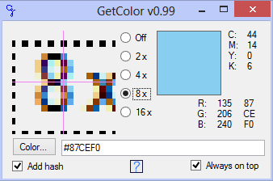

# Overview

Grabs color from screen into the clipboard.

Features:

- you select a color and it's already in the clipboard;
- shows color in RGB and CMYK.

# Download

[MiCalc.zip](https://bitbucket.org/liiws/GetColor/downloads/GetColor.7z) (0.1 MB).
